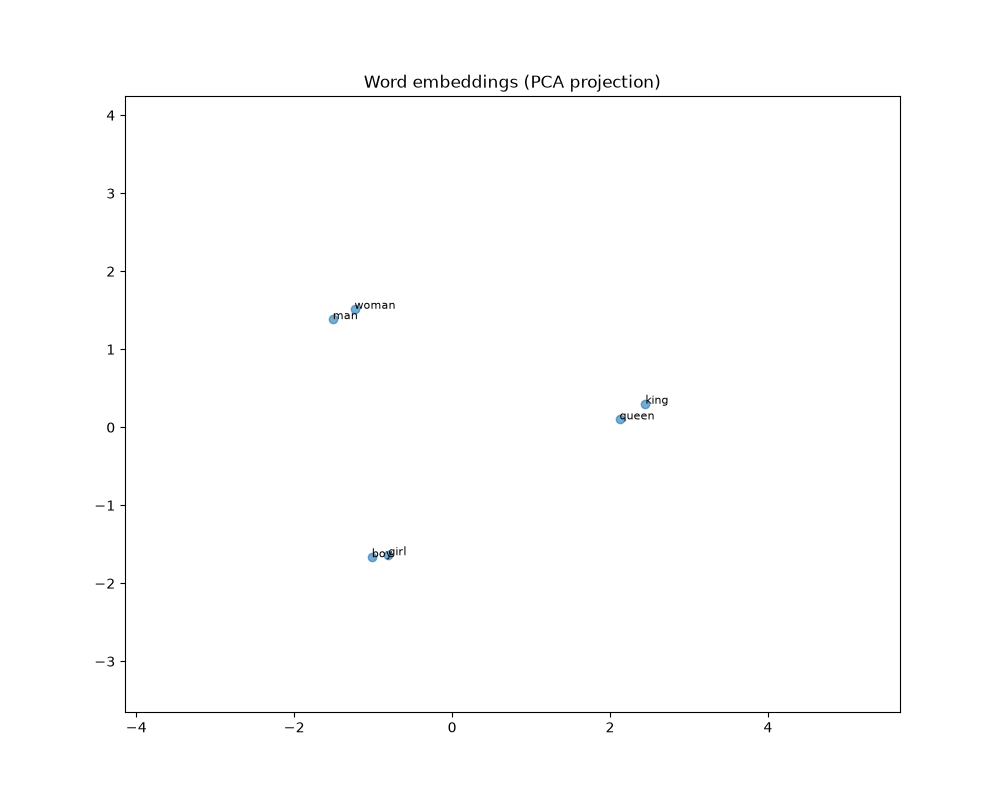

<h2>
Word2vec style vector embedding to understand meaning between words in .txt files. 
Will be used to develop badGPT 3.0, which will feature full transformer architecture
</head>
  
</h2>

 
<h1><b><u>HOW TO USE (first time):</u></b></h1>
<h3>
0.5. install dependencies obviously 
1. run main.py, which features a cli with instructions. 
2. train on the sample file provided (stories.txt) 
3. should take a while depending on your hardware, but will create a .npz file 
4. press m to manually test the fully trained model 
</h3>
(Simply drag and drop txt files in datasets then train)
 
<h3> !! G to generate is not currently supported, placeholder for ai generation in the future !! </h3>
  

<h1>Tests on 500mb + window size 5</h1>
<u><b>(RTX 3080 10GB + 16GB 3600mhz RAM w/ 500MB .txt file)</b></u>  
<h3> @ <b>50</b> dims:</h2>

<i>
Figure 1 shows relatively similar projected vector magnitude between gender of words 
</i>
 

<h3>@ <b>600</b> dims:</h3>

<i>
Figure 2 shows more precise precise vector magnitude 
</i>
 
<b>
<h3>
From these tests, we can prove that:   
<u>
Precision(<i>N</i>) = <i>k</i> &middot; <i>Ndim</i> where K is a positive constant
</u>
</h3>
</b>

   
<h2>All of this code was 100% human-written :)</h2>
